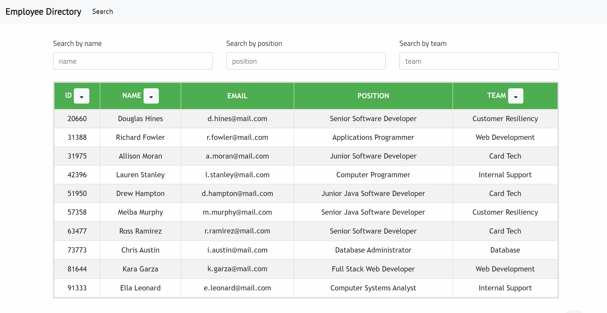

# Employee-Directory
Employee data management application with React that enables users to view, sort and filter the entire employee directory.

# Features
- Sort functionality (Ascending/Descending) with button:
    - by employee id
    - by employee name
    - by employee team
- Filter functionality with input:
    - by employee name
    - by employee position
    - by employee team
    
# Screenshots

# Tech/framework used
* Programming Languages: JavaScript, HTML, CSS
* CSS Framework: Bootstrap
* Browser Based Technologies: Responsive Design, Font Awesome
* Deployment: Heroku, Git, Node.js
* Library/Package: React
* Other tools: Visual Studio Code

# Live link
* [Employee-Directory](https://employee-directory-sc.herokuapp.com/) 
